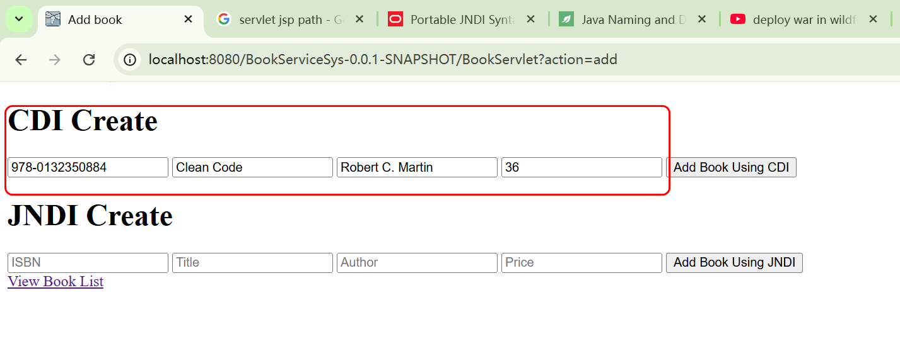
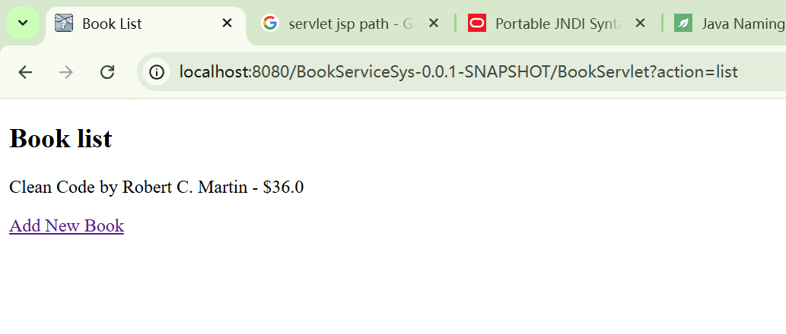
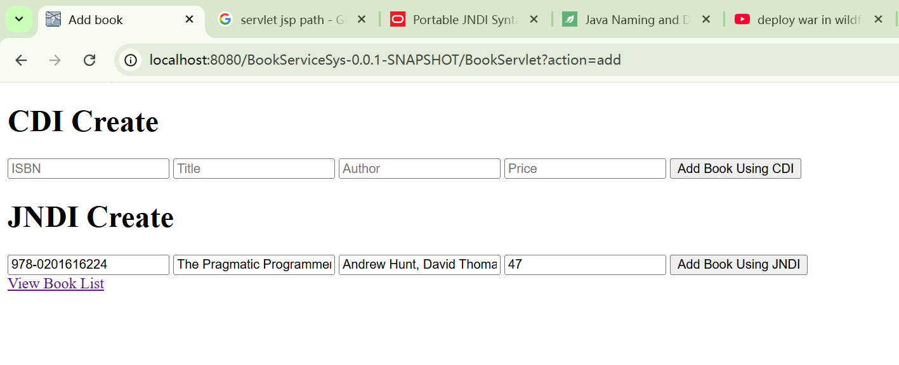
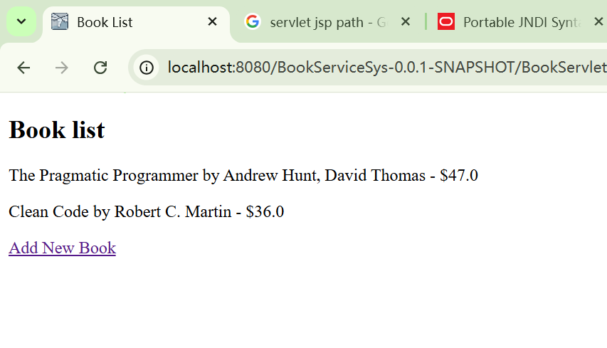

# J2EE Lab 8
A simple enterprise application to manage a list of books
using EJB, CDI, JNDI, and JSP with JSTL for the web interface, deployed on WildFly.

Test the concepts of Enterprise Java Beans (EJB), 
Java Naming and Directory Interface (JNDI), 
and Contexts and Dependency Injection (CDI). 

# How to Run
Clone the repository

Run 
```
mvn clean install
```

Config WildFly local server, deploy the application in the server.

Visit the application with
```
http://localhost:8080/BookServiceSys-0.0.1-SNAPSHOT/BookServlet?action=list
```

# Screenshots
## Add Book Using CDI


## Add Book Using JNDI



# Group Members
| Name             | N_ID      |
|------------------|-----------|
| Marina Carvalho  | N01606437 |
| Vitaly Sukhinin  | N01605938 |
| Kexin Zhu        | N01621302 |
| Samruddhi Chavan | N01604191 |
| Sruthi Pandiath  | N01618202 |
